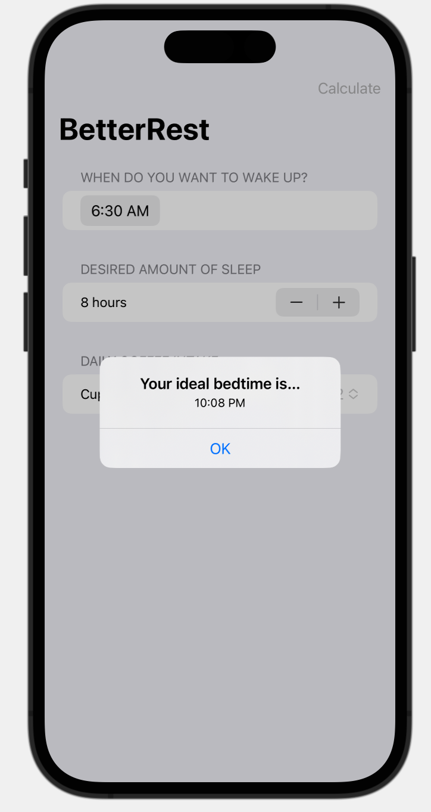

#  BetterRest (Project 4, Day 26-28)

This app uses Core ML to make predictions about bed time based on the following input variables: when you want to wake up, desired amount of sleep, and importantly, the daily coffee intake.

**The objectives of this app are:**
- Introduction to Core ML
- Layout, toolbar buttons, and stepper and picker
- Using date formats

The below figures show a preview of the BetterRest app.

Main View              |  Feedback Alert      
:---------------------:|:--------------------------
 |  