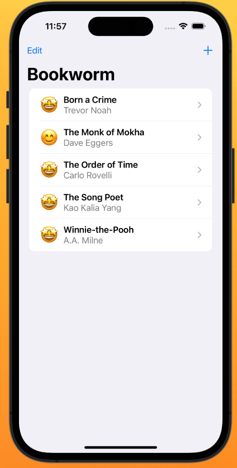
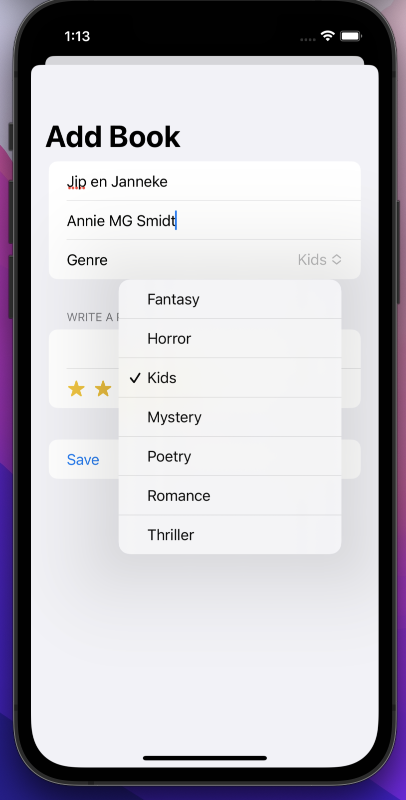
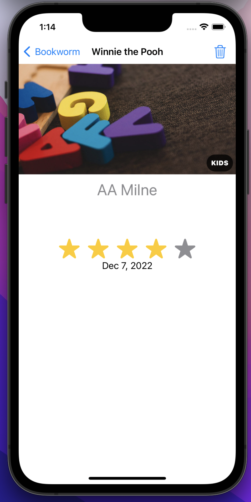

#  Bookworm (Project 11, Day 53-56)

The app lets you upload and review books.

**The objectives of this app are:**
- Using Core Data to store data
- Sorting fetch requests in Core Data
- Creating custom components that change across views with @Binding

The below figures show a preview of the Bookworm app.

Main View              |  Add Book View             | Detail View   
:---------------------:|:-------------------------:|:--------------------------
 |  | 