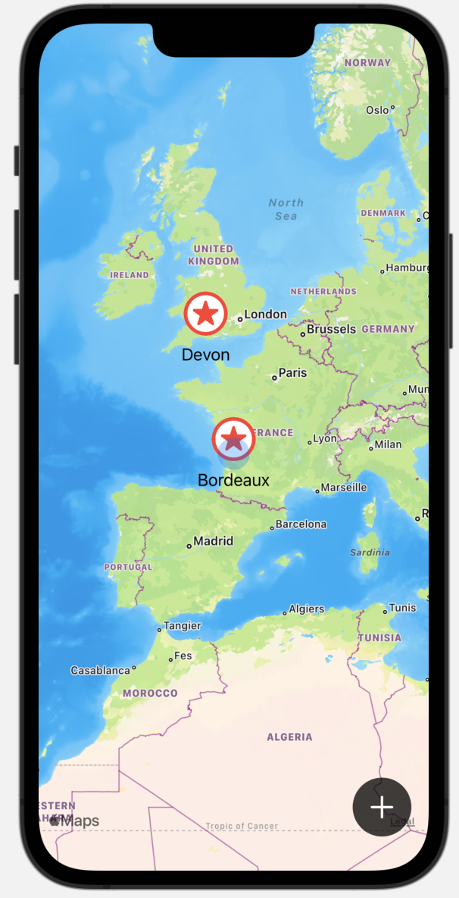
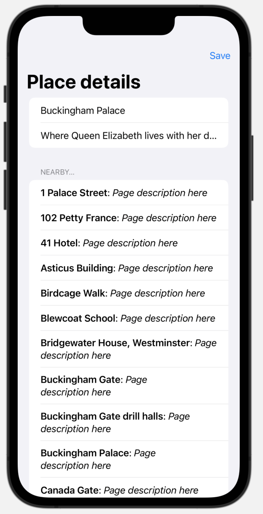

#  BucketList (Project 14, Day 68-73)

This app let you mark and edit places on a map. Given a location, it uses Wikipedia to recommend similar places nearby. 

**The objectives of this app are:**
- Writing data to the Documents Directory
- Using Touch ID and Face ID
- Integrating MapKit with SwiftUI
- Adding user locations and annotations on a map, editing map annotations
- Downloading data with an API
- Conforming to MVVM

The below figures show a preview of the BucketList app.

Main View              |  Recommendation View   
:---------------------:|:-------------------------
 | 