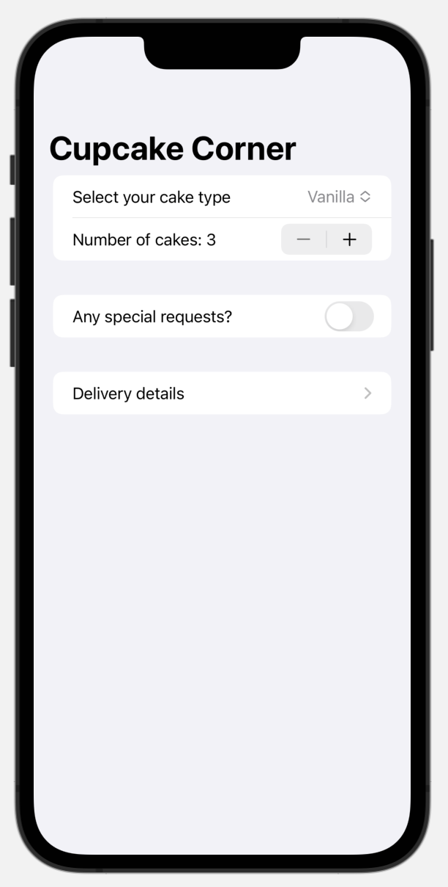
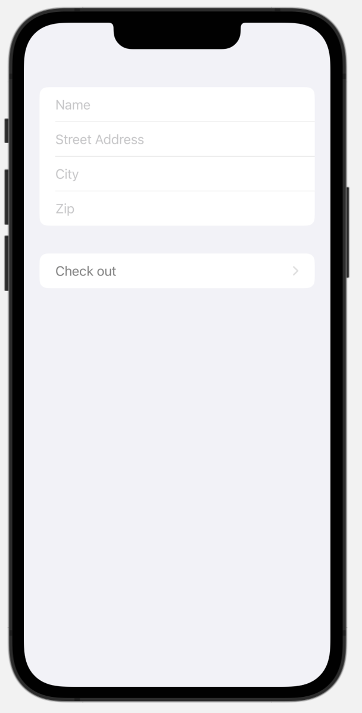
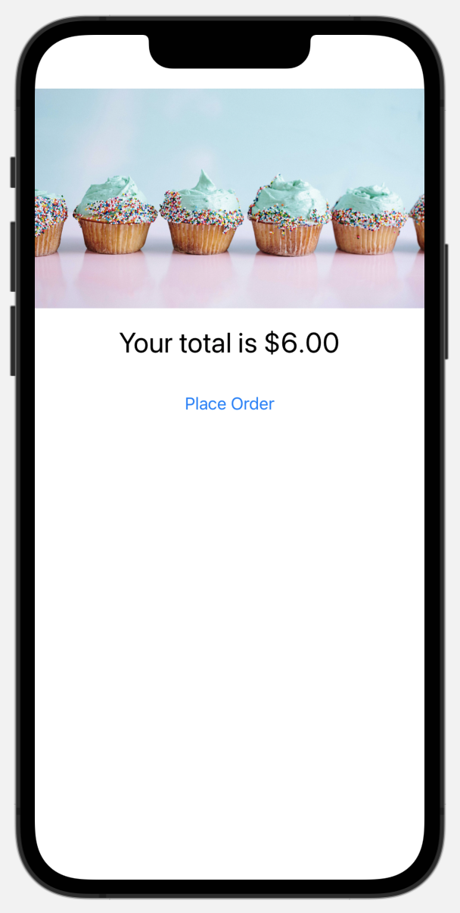

#  Cupcake Corner (Project 10, Day 49-52)

This app builds an interface to send and receive data over the internet to order cupcakes.

**The objectives of this app are:**
- Sharing Codable data across views with @Published
- Sending and receiving codable data with URLSession
- Loading an image from a remote server
- Validating and disabling forms

The below figures show a preview of the Cupcake Corner app.

Main View              |  Address View             | Checkout View   
:---------------------:|:-------------------------:|:--------------------------
 |  | 