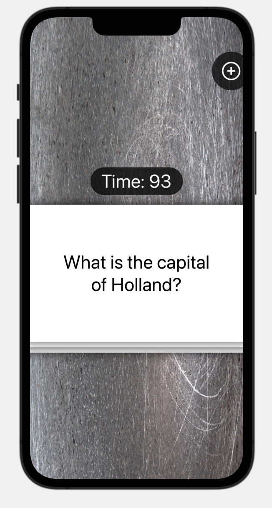
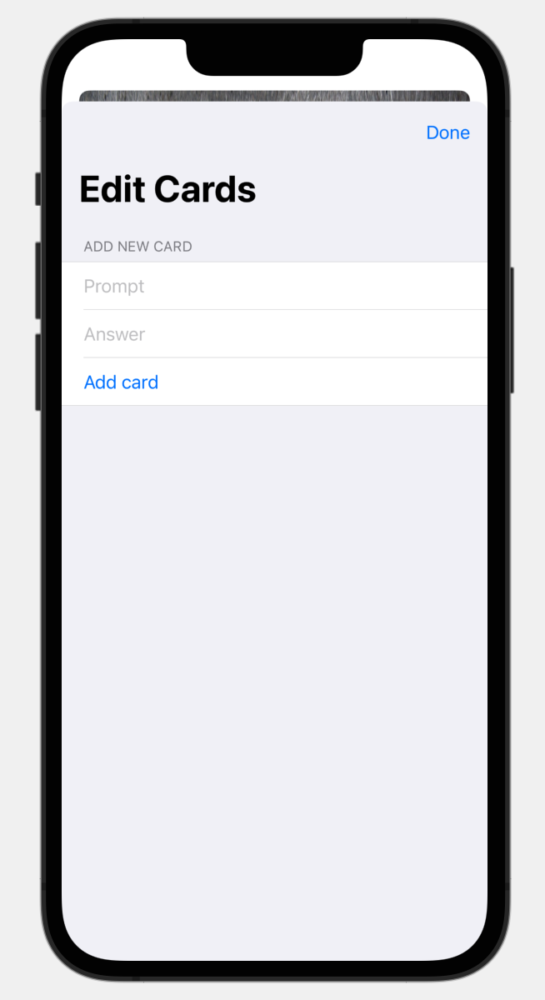

#  Flashzilla (Project 17, Day 86-91)

This app lets you create a stack of cards with questions and tests your memory under a timed interval.

**The objectives of this app are:**
- Using gestures
- Adding vibrations
- Disabling user interactivity
- Triggering events repeatedly using a timer
- Let your device notice when the app moves to the background
- Supporting specific accessibility needs (e.g. color blindness)

The below figures show a preview of Flashzilla app.

Main View              |  Edit View   
:---------------------:|:-------------------------
 | 
