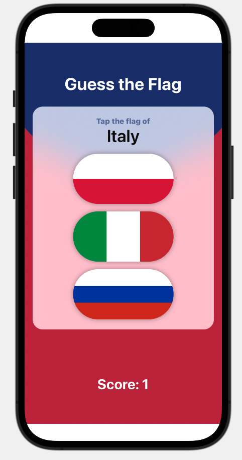
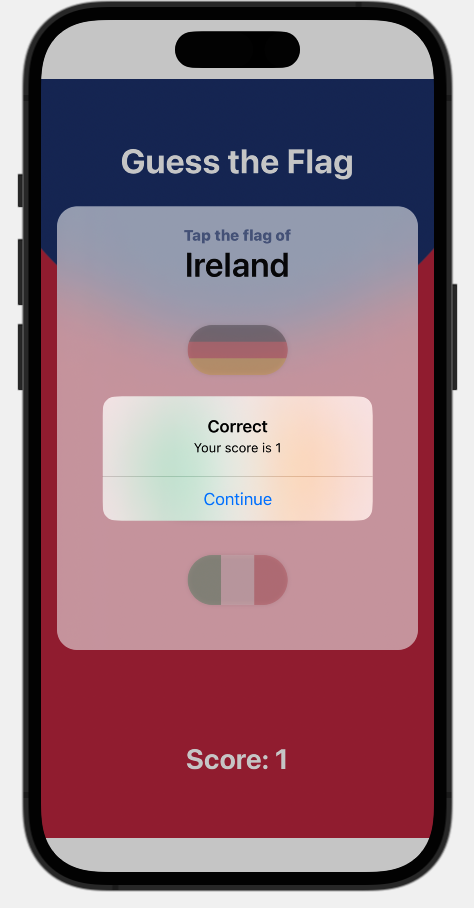
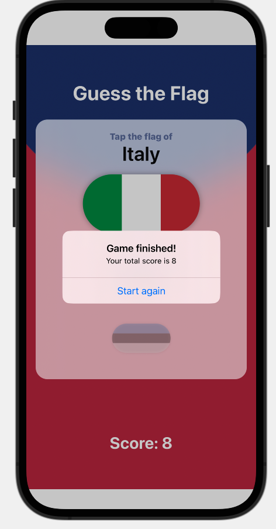

#  Guess The Flag (Project 2, Day 20-22)

This app is a game where you'll tap the correct flag and get a score. The game finishes after a specified number of questions. When tapping a picture the flag rotates around its axis and you receive feedback through an alert message.

**The objectives of this app are:**
- Counting the score and finishing at x number of questions 
- Using an alert message to show feedback
- Working with shapes and rotations
- Mapping images to indices

The below figures show a preview of the Guess The Flag app.

Start Game             |  Feedback Score       | End Game
:---------------------:|:---------------------:|:--------------------------
 |  | 
