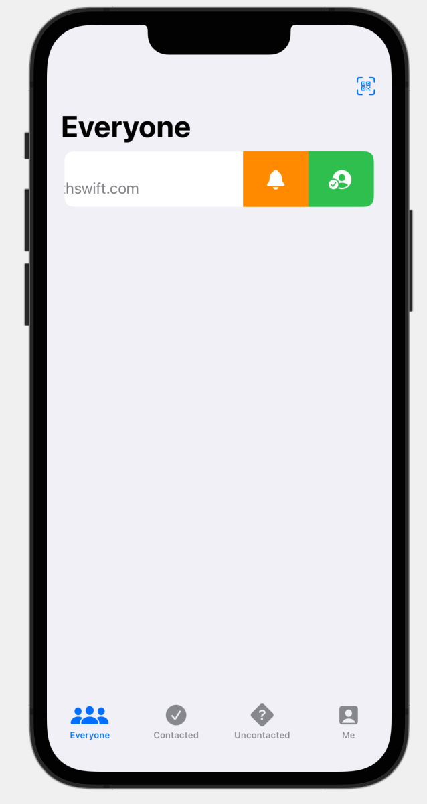
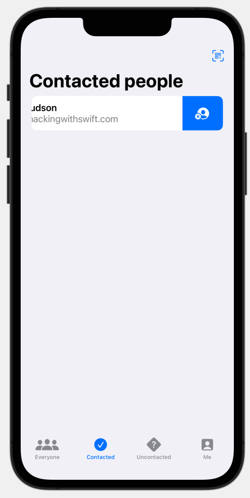
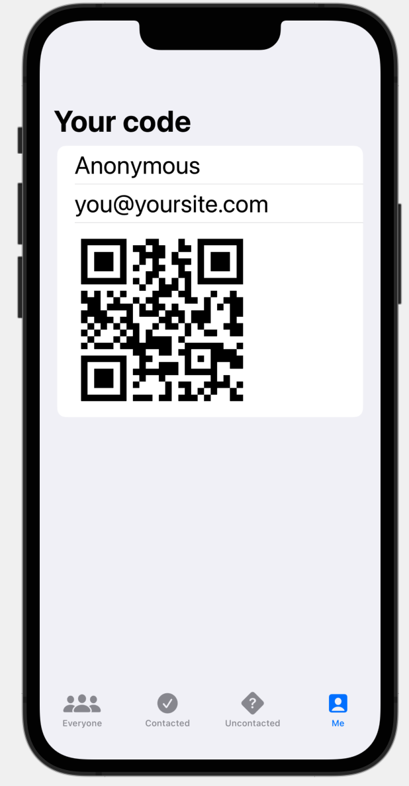
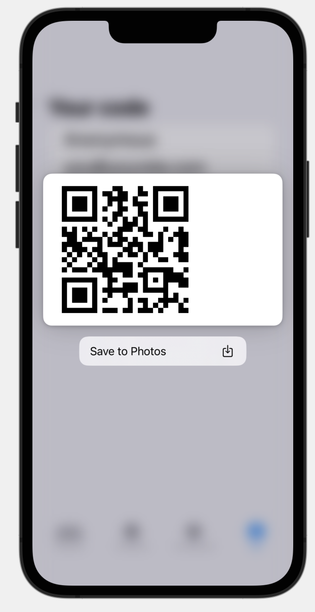
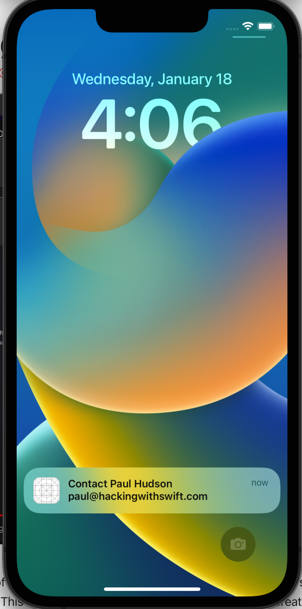

#  Hot Prospects (Project 16, Day 79-85)

This app tracks a list of contacts. Users can add a new contact to their list with a QR code, for example, generated at a conference. Contacts can be marked as contacted and automatically move to another defined list.

**The objectives of this app are:**
- Reading custom values from the environment
- Creating tabs
- Returning errors with Swifts Result type
- Manually publishing ObservableObject changes
- Controlling image interpolation
- Adding custom row swipe actions to a List
- Scheduling local notifications
- Adding Swift package dependencies

The below figures show a preview of the Hot Prospects app.

Main View              |  Contacted View   
:---------------------:|:-------------------------
 | 

Your QR Code           |  Save QR Code  
:---------------------:|:-------------------------
 | 

Reminder Home Screen              
:-------------------------:|
 | 