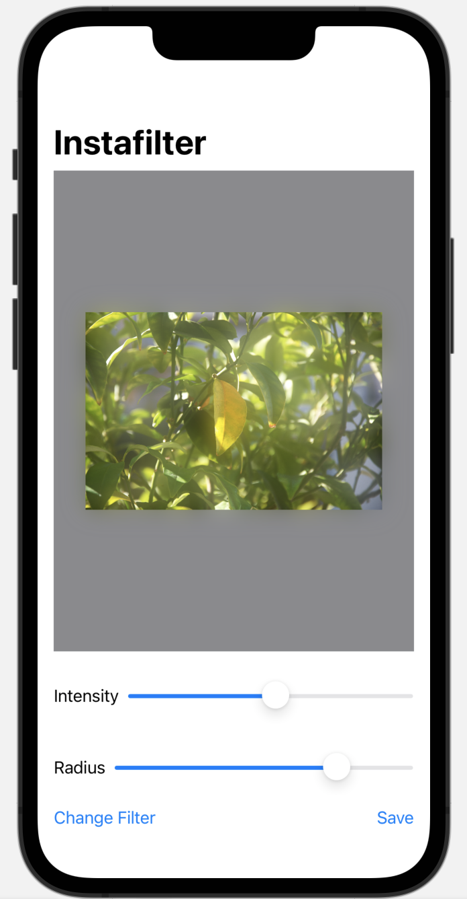

#  Instafilter (Project 13, Day 62-67)

This app lets you import an image, apply a filter, and save it to the user's library.

**The objectives of this app are:**
- Responding to state changes using onChange()
- Showing multiple options with confirmationDialog()
- Using Core Image and filters
- Saving images to the user's photo library
- Importing an image into SwiftUI

The below figure shows a preview of the Instafilter app.

Main View              
:-----------------:|
 | 
