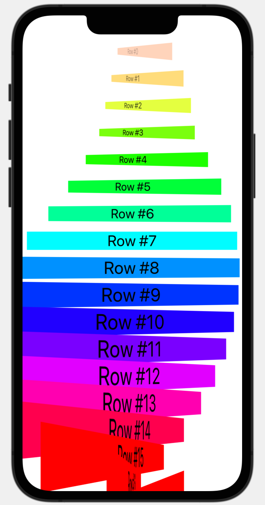

#  Layout And Geometry (Project 18, Day 92-94)

This view shows an alignment, positioning, and scrollview effect.
\
**The objectives of this app are:**
- Alginment and alignment guides
- Positioning for SwiftUI views
- Understanding frames and coordinates inside GeometryReader
- ScrollView effects

The below figure shows a preview of Layout And Geometry app.

Rotating Effect    |  
:-----------------:|
 | 
