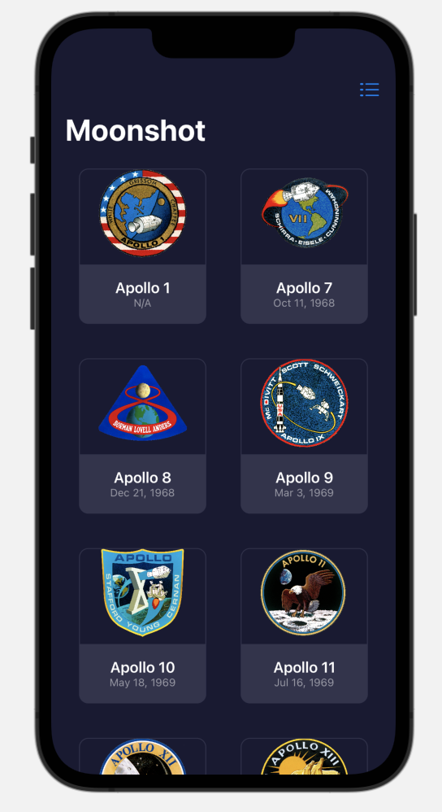

#  Moonshot (Project 8, Day 39-42)

This app displays structured information from a json file in multiple detail views. 

**The objectives of this app are:**
- Adding NavigationLink views
- Resizing images
- Loading data in json
- Formatting a view
- Using a scroll view
- Working with multiple Views
- Creating custom Views

The below figures show a preview of the Moonshot app.

Main View - Grid               |  Main View - List       
:-----------------------------:|:--------------------------
 |  

Mission View                   |  Astronaut View         
:-----------------------------:|:--------------------------
 |  
