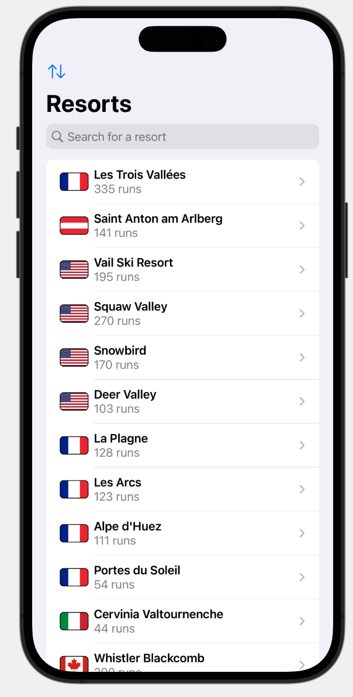
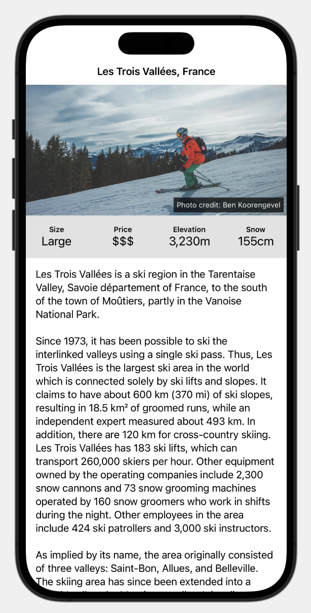
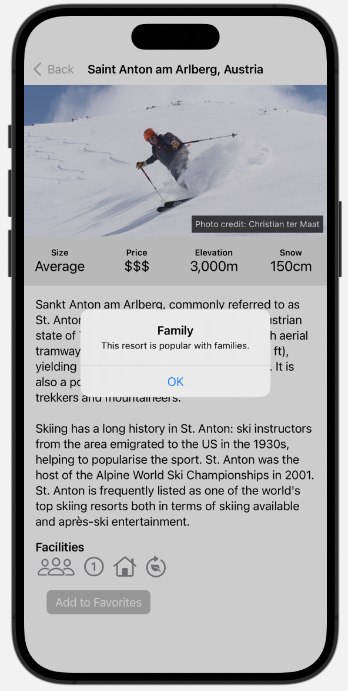

#  SnowSeeker (Project 19, Day 96-99)

This app shows two views side by side: 1.) A list of ski resorts and 2.) A detail view per ski resort, depending on the size of your phone or tablet.

**The objectives of this app are:**
- Adjusting the layout according to the screen size of the phone or tablet,
- Adding a Search option to search for characters in the ski resort names,
- Marking ski resorts as favorite.

The data for the ski resorts are stored in the JSON file ``resorts.json``.

The below figures show a preview of the SnowSeeker app.

{: style="height:83px"}
{: style="height:83px"}
{: style="height:83px"}

