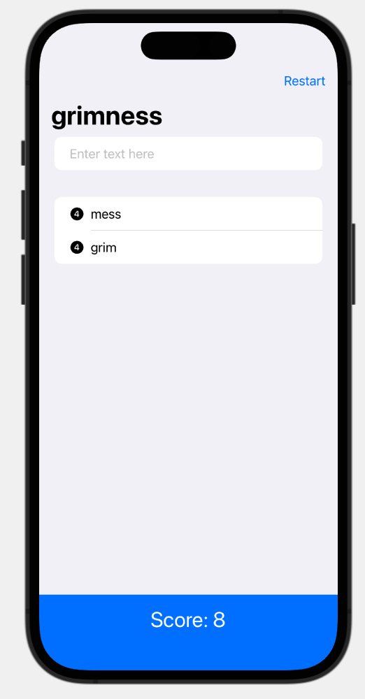

#  WordScramble (Project 4, Day 26-28)

This app let you build new words given a displayed word. The game gives you a score based on the length of the new words and the total generated words.

**The objectives of this app are:**
- Using lists and strings
- Writing error messages
- Display a function onAppear

The below figure shows a preview of the WordScramble app.

Main View          |           
:-----------------:|
 | 
