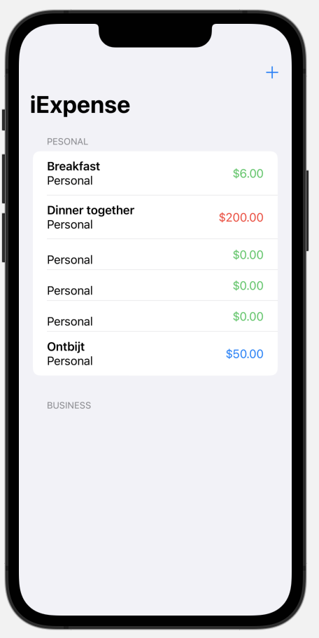
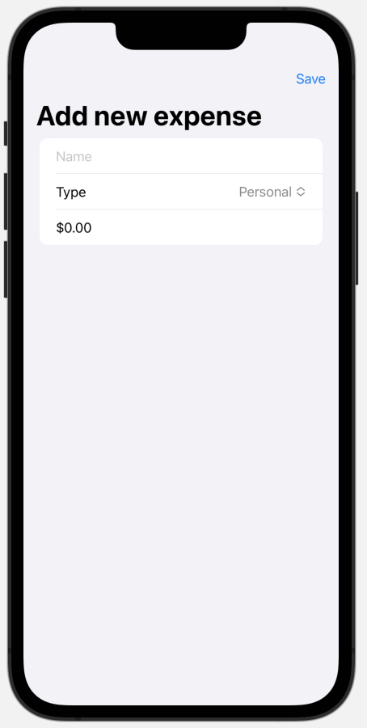

#  iExpense (Project 7, Day 36-38)

This app builds an expense interface to keep track of expenses by category.

**The objectives of this app are:**
- Storing user data with UserDefaults
- Deleting items
- Sharing data across views
- Adding data in a second view
- Grouping data 

The below figures show a preview of the iExpense app.

Main View              |  Adding Data         
:---------------------:|:--------------------------
 |  