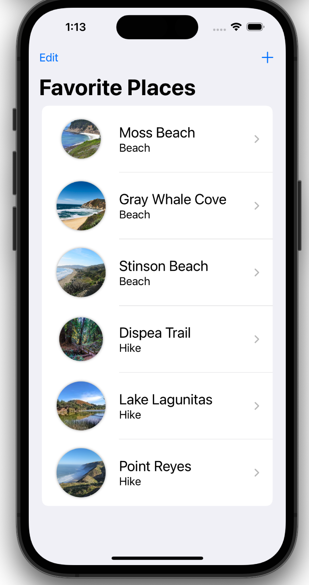
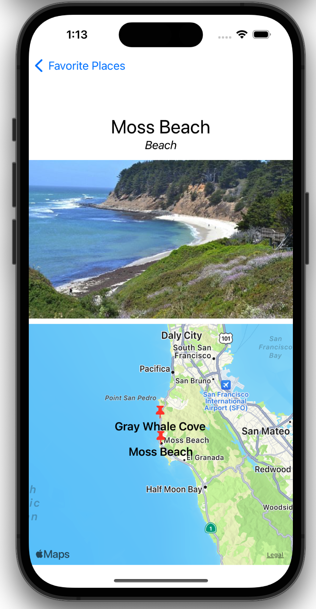
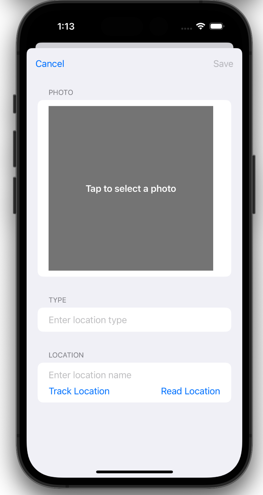

# Person Lookup (Milestone Project 13-15)

This app lets the user build a collection of things, marked by the current location and a photo added from the user's library. For this app I changed the subject of a Person Lookup app to an app to store visited places. 
Prerequisite of this app is that the user allows to track the location of the device at the moment that the user marks his or her location. 

The below figures show a preview of the app.

Main View              |  Detail View              | Add Place        
:---------------------:|:-------------------------:|:-------------------
 |   |  