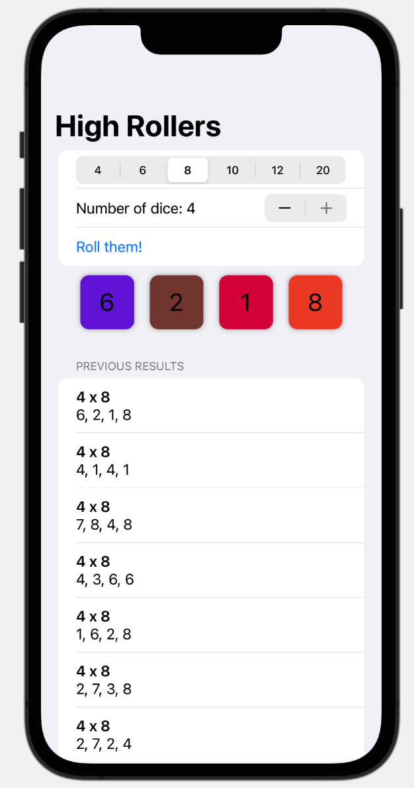

# RollDice (Milestone Project 16-18)

This app stores the random rolls of a dice in a list. Choosing what type of dice to roll and how many rolls. The app adds a special rotation effect to the number that is being rolled. In addition to that I experimented to adding random colors to this rotation effect.

The below figure shows a preview of the app.

Main View              | 
:---------------------:|
 |  